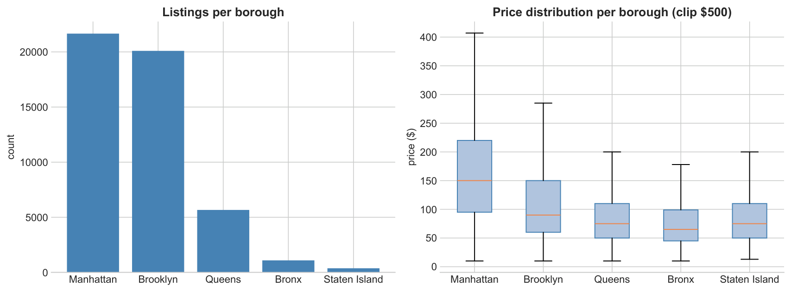
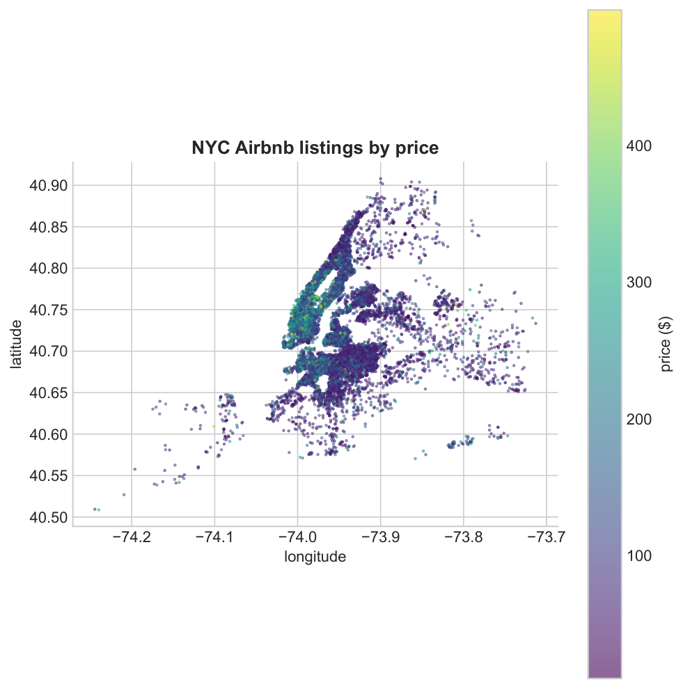
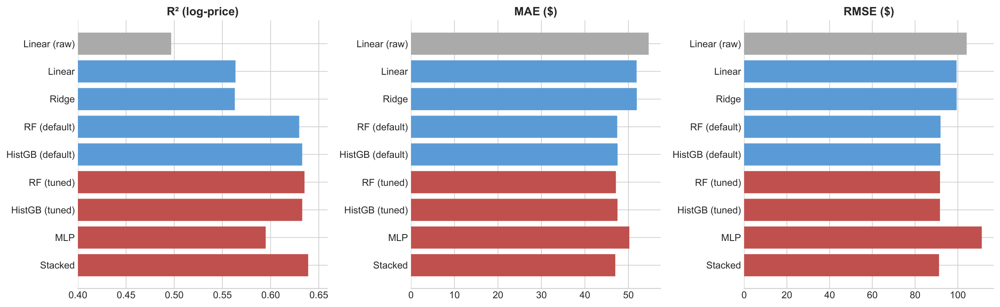
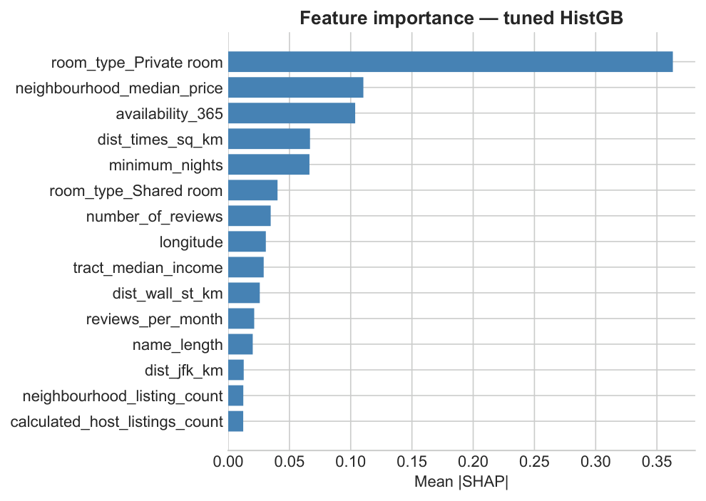
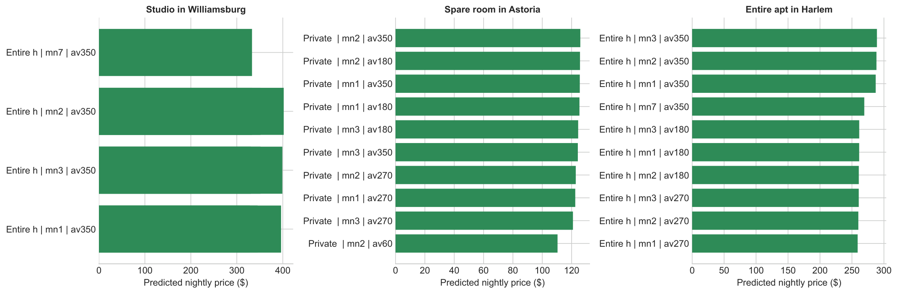

# NYC Airbnb Price Prediction & Host Strategy

Using ~48,895 listings from [Inside Airbnb](https://insideairbnb.com/get-the-data) (2019), we built a price-prediction pipeline and a grid-search optimizer that tells a host the best room type, minimum-stay, and availability configuration for their neighborhood.

**Research questions**
1. Which features most drive nightly price, and how much variance can be explained from public data?
2. Given a fixed location, which listing configuration maximizes predicted nightly price?

## Data

| Source | What it adds |
|---|---|
| Inside Airbnb listings (~48k rows) | Price, location, room type, availability, reviews |
| ACS 2015–2019 (census tract) | Median household income per tract |
| MTA Subway Stations (NY Open Data) | Distance to nearest subway station |
| 4 NYC anchors (Times Sq, Central Park, JFK, LGA, Wall St) | Haversine distance features |

Price is heavily right-skewed (skewness = 19.12, mean $153, median $106). We train on `log(1 + price)` winsorized at the 99th percentile (~$500).

Manhattan commands the highest prices (mean $197); Brooklyn has the most listings (41.1%). Room type splits: entire homes 52% (mean $212), private rooms 46% (mean $90), shared rooms 2% (mean $70).

The radial price gradient centered on lower Manhattan motivated the `dist_times_sq_km` engineered feature.

## Features

Beyond the 7 raw numeric fields and one-hot borough/room type (20 columns total), we engineer:

- `neighbourhood_median_price` — out-of-fold target-encoded neighborhood median (leakage-safe)
- `dist_times_sq_km` — haversine distance to Times Square
- `host_tenure_days` — proxy for host experience
- `availability_ratio`, `name_length`, `neighbourhood_listing_count`, `reviews_per_tenure_day`
- 6 external features: `tract_median_income`, `dist_subway_km`, `dist_central_park_km`, `dist_jfk_km`, `dist_lga_km`, `dist_wall_st_km`

## Models

| Model | RMSE ($) | MAE ($) | R² (log) |
|---|---|---|---|
| Linear (raw features only) | 104.15 | 54.66 | 0.4969 |
| Linear Regression | 99.41 | 51.89 | 0.5636 |
| Random Forest (tuned) | 91.68 | 47.12 | 0.6351 |
| HistGradientBoosting (tuned) | 91.65 | 47.49 | 0.6328 |
| **Stacked (HGB + RF + MLP)** | **91.22** | **46.98** | **0.6390** |

*5-fold CV on full engineered + external feature matrix.*

**Held-out test set:** Stacked ensemble achieves **R²_log = 0.6300, MAE = $47.25** which is a +0.133 R² improvement and −$7.41 MAE reduction over the raw linear baseline.

The largest single jump is from linear to tree-based models; tuning, the MLP, and stacking add a smaller but consistent further improvement.

## Feature Importance (SHAP)

Top drivers (mean |SHAP|):
1. `room_type_Private room` (0.36) — by far the largest contributor
2. `neighbourhood_median_price` (0.11)
3. `availability_365` (0.10)
4. `dist_times_sq_km` (0.07)
5. `minimum_nights` (0.07)

External features add modest signal: `tract_median_income` ranks 9th (0.029). Adding all six external features improves cross-validated R² by only +0.0015, as `neighbourhood_median_price` already captures most geographic signal.

## Host Strategy Optimization

We grid-search over actionable features (room type, minimum nights, availability, listing name length) while holding location fixed for three prospective-host scenarios:

| Scenario | Optimal config | Predicted price |
|---|---|---|
| Studio in Williamsburg (Brooklyn) | Entire home, min 2 nights, avail. 350 d, name length 80 | $402 |
| Spare room in Astoria (Queens) | Private room, min 2 nights, avail. 350 d, name length 80 | $126 |
| Entire apt in Harlem (Manhattan) | Entire home, min 3 nights, avail. 350 d, name length 80 | $289 |

**Consistent patterns across all scenarios:**
- Whole-unit framing wins wherever the host has the option
- High availability (~270–350 days) is preferred; extreme availability adds diminishing returns
- Short minimum stays outperform 30+ night minimums
- Longer listing names correlate weakly but consistently with higher predicted price

## Limitations

- **No booking data**: We optimize listed price, not revenue (occupancy unknown)
- **Luxury tail bias**: Model under-predicts Manhattan / entire-home listings above ~$300
- **2019 snapshot**: Seasonality and post-2023 NYC short-term rental regulations are out of scope
